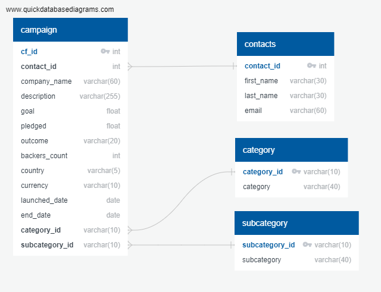
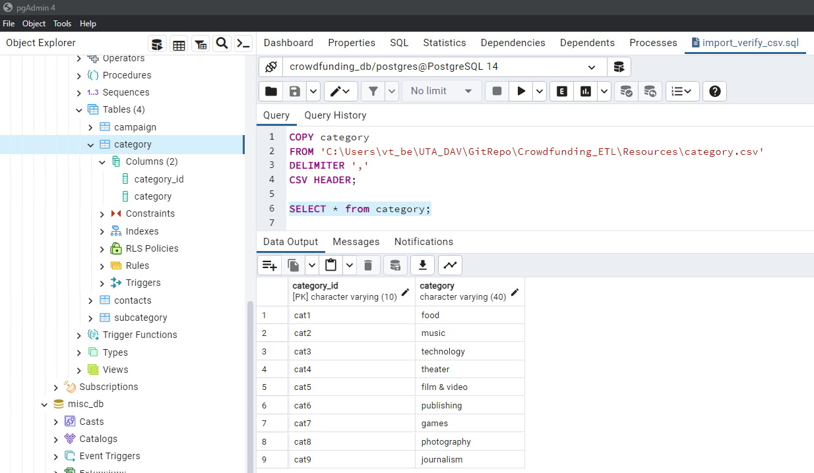
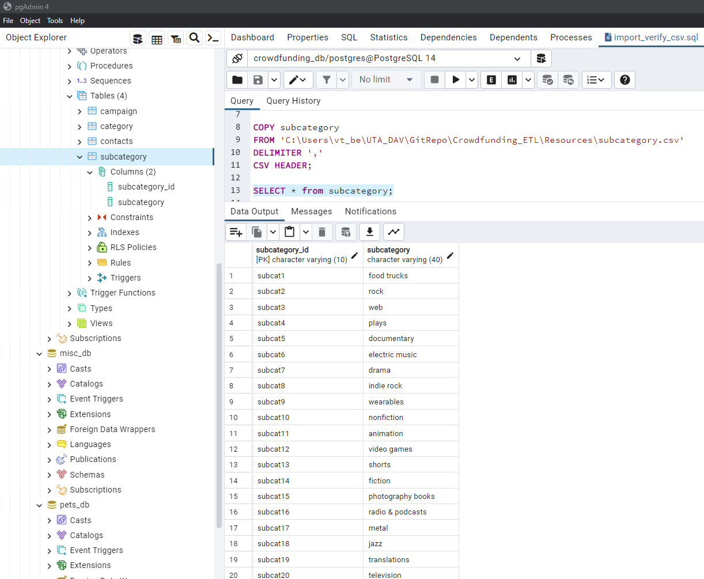
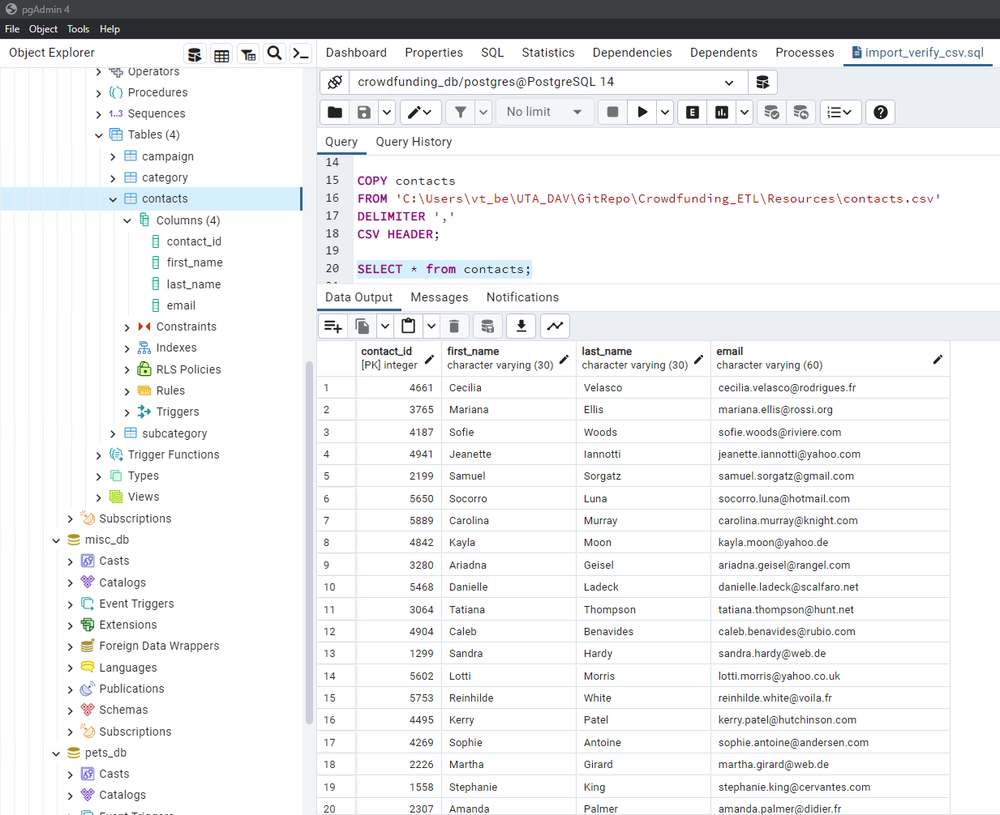
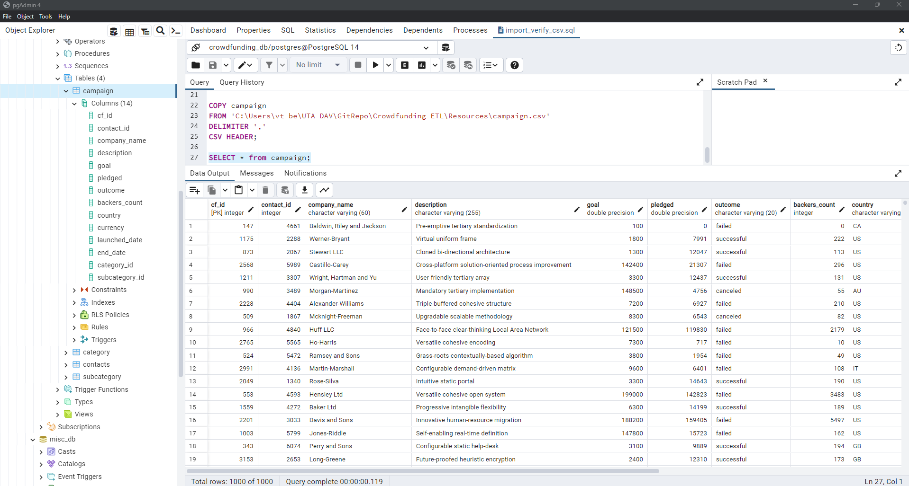

# Crowdfunding_ETL
This repository contains files for UT DAV Bootcamp Module 13 Mini-Project ETL

# Features
* Extract data from the crowdfunding.xlsx 
* Extract data from the contacts.xlsx 
* Transform crowdfunding data into a normalized category table
* Transform crowdfunding data into a normalized subcategory table
* Transform crowdfunding data into a normalized campaign table
* Transform contacts data into a normalized contacts table
* Load the tables into a database (crowdfunding_db) and verify they loaded correctly

# File Notes
* ETL_Mini_Project_FINAL.ipynb contains the code to extract and transform the data from the xlsx files. Contributors:
  * Nathan Humphreys Lucas created category and subcategory dataframes and csv files
  * Isac Ramos created campaign dataframe and csv file
  * Rebekah Aldrich created contacts dataframe and csv file
* crowdfunding_db_schema.sql is the SQL script to create the tables for the "crowdfunding_db" database. This portion was completed as partner programming in class 3 of the module.
* import_verify_csv.sql is the script to upload the data (csv files in Resources) and verify they were uploaded correctly. This portion was completed as partner programming in class 3 of the module.
* Resources folder contains files downloaded from BCS as well as files generated to upload to the new database
  * contacts.xlsx contains data downloaded from BCS for the project
  * crowdfunding.xlsx contains data downloaded from BCS for the project
  * category.csv contains the table of categories created from crowdfunding.xlsx to be uploaded into the database
  * subcategory.csv contains the table of subcategories created from crowdfunding.xlsx to be uploaded into the database
  * campaign.csv contains the table of campaigns created from crowdfunding.xlsx to be uploaded into the database
  * contacts.csv contains the table of contacts created from contacts.xlsx to be uploaded into the database  
* images folder contains the ERD image as well as images from queries completed in pgAdmin / postgreSQL
  * ERD 
  * category import  
  * subcategory import 
  * contacts import 
  * campaign import 
    

# References
* ...
 

# Getting Started

## Prerequisites
You must have python, jupyter notebok / lab, conda, matplotlib, pandas, json, numpy, PostgreSQL, pgAdmin 4 (or other PostrgreSQL interface) 

## Cloning Repo
$ git clone https://github.com/vt-bekah/Crowdfunding_ETL.git 

$ cd Crowdfunding_ETL

# Built With
* Python v3.10.11
* jupyter notebook v6.5.2
* jupyterlab v3.6.3
* conda v23.5.0
* PostgreSQL v14.8
* pgAdmin 4 v7.5

**Python Modules**
* pandas v1.5.3
* numpy v1.24.3
* json v2.0.9

